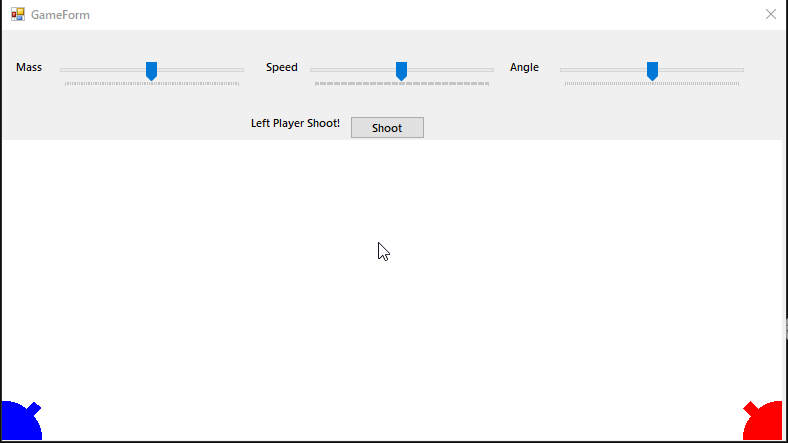

# Ballistic Game in C++/CLR (Windows Forms Visual C++) #

One day some stupid guy asked me to write a program to play the Ballistic Game. Using the capabilities of the modern Internet, I did it.

## Description ##

Task: Ballistic Game

At different ends of the screen are two ballistic units belonging to different players. Players take turns. The move consists of selecting the mass of the stone for the ballista, the initial velocity of the stone, and the angle between the vector of initial velocity and the horizon. Using this data, the program should calculate the trajectory of the stone and simulate the flight on the screen. After the first player moves the second player, etc. The game ends when one of the stones hits the opponent's ballista.

## Demonstration ##

### General Demonstration ###

## License ##

[MIT](LICENSE.md)