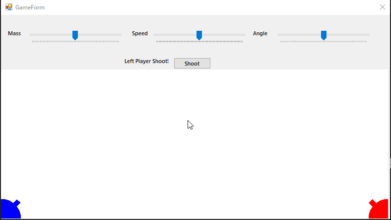
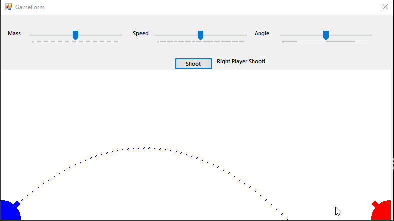

# Баллистическая игра на C++/CLR (Windows Forms Visual C++) #

Однажды какой-то человек попросил меня написать программу для игры в Баллистическую игру. Используя возможности современного Интернета, я это сделал.

## Описание ##

Задание: Баллистическая игра

В разных концах экрана расположены две баллисты, принадлежащие разным игрокам. Игроки ходят по очереди. Ход заключается в выборе массы камня для баллисты, начальнойскорости камня и угла между вектором начальной скорости и горизонтом. По этим данным программа должна произвести расчет траектории полета камня и смоделировать полет на экране. После первого игрока ходит второй и т.д. Игра заканчивается, когда один из камнейпопадет в баллисту противника.

## Демонстрация ##

### Общая демонстрация работы программы ###

## Лицензия ##

[MIT](LICENSE.md)